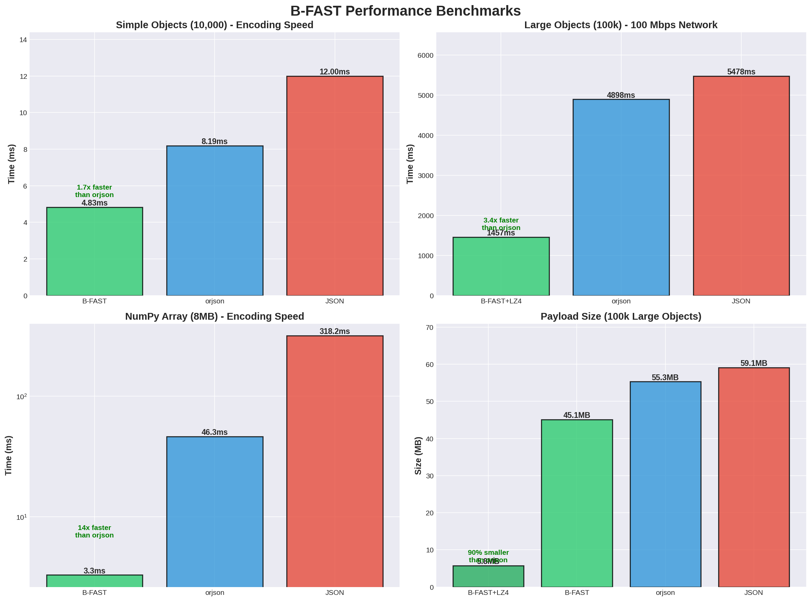

## ⚡ B-FAST (Binary Fast Adaptive Serialization Transfer)

B-FAST is an ultra-high performance binary serialization protocol, developed in Rust for Python and TypeScript ecosystems. It's designed to replace JSON in critical routes where latency, CPU usage, and bandwidth are bottlenecks.

> "Performance is not just about speed—it's about efficiency where it matters most"

B-FAST was born from the recognition that modern applications need more than just fast serialization—they need **smart serialization** that adapts to real-world constraints. After extensive optimization, B-FAST has found its perfect niche in bandwidth-constrained environments, achieving **1.7x faster** than orjson for simple objects and **5.7x faster** on slow networks.

**Philosophy:** We believe that the future of data transfer lies not in raw CPU speed alone, but in intelligent protocols that minimize network overhead while maintaining excellent performance. B-FAST represents our contribution to a more efficient, bandwidth-conscious web.

## 📚 Documentation
Full documentation available at: **https://marcelomarkus.github.io/b-fast/**

## 🚀 Why B-FAST?
- **Rust Engine:** Native serialization without Python interpreter overhead.
- **Pydantic Native:** Reads Pydantic model attributes directly from memory, skipping the slow .model_dump() process.
- **Zero-Copy NumPy:** Serializes tensors and numeric arrays directly, achieving 14-96x speedup vs JSON/orjson.
- **Parallel Compression:** LZ4 with multi-thread processing for large payloads (>1MB).
- **Cache Optimized:** Aligned allocation and batch processing for maximum efficiency.

## 📊 Benchmarks (Updated Results)

### 🚀 Simple Objects (10,000)
| Format | Time (ms) | Speedup |
|--------|-----------|---------|
| JSON | 12.0ms | 1.0x |
| orjson | 8.19ms | 1.5x |
| **B-FAST** | **4.83ms** | **🚀 2.5x** |

**B-FAST is 1.7x faster than orjson!**

### 🔄 Round-Trip (Encode + Network + Decode)
Complete test including network transfer and deserialization (10,000 objects):

#### 📡 100 Mbps (Slow Network)
| Format | Total Time | Speedup vs orjson |
|--------|------------|-------------------|
| JSON | 114.5ms | 0.8x |
| orjson | 91.7ms | 1.0x |
| **B-FAST + LZ4** | **16.1ms** | **🚀 5.7x** |

#### 📡 1 Gbps (Fast Network)
| Format | Total Time | Speedup vs orjson |
|--------|------------|-------------------|
| JSON | 29.4ms | 0.5x |
| orjson | 15.3ms | 1.0x |
| **B-FAST + LZ4** | **7.2ms** | **🚀 2.1x** |

#### 📡 10 Gbps (Ultra-Fast Network)
| Format | Total Time | Speedup vs orjson |
|--------|------------|-------------------|
| JSON | 20.9ms | 0.4x |
| orjson | 7.7ms | 1.0x |
| **B-FAST + LZ4** | **6.3ms** | **🚀 1.2x** |

### 🎯 Ideal Use Cases
- **📱 Mobile/IoT**: 89% data savings + 5.7x performance on slow networks
- **🌐 APIs with slow networks**: Up to 5.7x faster than orjson
- **📊 Data pipelines**: 14-96x speedup for NumPy arrays
- **🗜️ Storage/Cache**: Superior integrated compression
- **🚀 Simple objects**: 1.7x faster than orjson

## 📦 Installation

### Backend (Python)
```bash
uv add bfast-py
```
or
```bash
pip install bfast-py
```

### Frontend (TypeScript)
```bash
npm install bfast-client
```

## 🛠️ How to Use

### Backend (Python)

#### 1. FastAPI (Direct Integration) ⭐ Recommended
B-FAST integrates seamlessly as a response class.

```python
from fastapi import FastAPI, Response
from pydantic import BaseModel
import b_fast

class BFastResponse(Response):
    media_type = "application/x-bfast"
    
    def __init__(self, content=None, *args, **kwargs):
        super().__init__(content, *args, **kwargs)
        self.encoder = b_fast.BFast()

    def render(self, content) -> bytes:
        return self.encoder.encode_packed(content, compress=True)

app = FastAPI()

class User(BaseModel):
    id: int
    name: str

@app.get("/users", response_class=BFastResponse)
async def get_users():
    return [User(id=i, name=f"User {i}") for i in range(1000)]
```

#### 2. Flask
```python
from flask import Flask, Response
import b_fast

app = Flask(__name__)
encoder = b_fast.BFast()

@app.route('/users')
def get_users():
    users = [{"id": i, "name": f"User {i}"} for i in range(1000)]
    data = encoder.encode_packed(users, compress=True)
    return Response(data, mimetype='application/octet-stream')
```

#### 3. Django
```python
from django.http import HttpResponse
import b_fast

encoder = b_fast.BFast()

def get_users(request):
    users = [{"id": i, "name": f"User {i}"} for i in range(1000)]
    data = encoder.encode_packed(users, compress=True)
    return HttpResponse(data, content_type='application/octet-stream')
```

#### 4. Any Python Framework
```python
import b_fast

encoder = b_fast.BFast()

# Encode your data
data = encoder.encode_packed(your_data, compress=True)

# Return as bytes (binary response)
```

### Frontend (TypeScript)

```typescript
import { BFastDecoder } from 'bfast-client';

async function loadData() {
    const response = await fetch('/users');
    const buffer = await response.arrayBuffer();
    
    // Decodes and decompresses LZ4 automatically
    const users = BFastDecoder.decode(buffer);
    console.log(users);
}
```

## About B-FAST

**Key Achievements:**
- 🚀 **1.7x faster** than orjson for simple objects
- 🚀 **5.7x faster** than orjson on 100 Mbps networks (round-trip)
- 📦 **89% smaller** payloads with built-in LZ4 compression
- ⚡ **14-96x speedup** for NumPy arrays
- 🎯 **Competitive** even on ultra-fast 10 Gbps networks

<p align="center">
  
</p>

<p align="center">
  <em>B-FAST performance comparison across different scenarios: simple objects, large objects on 100 Mbps network, NumPy arrays, and payload size. B-FAST demonstrates superiority in speed (1.7-14x faster) and bandwidth efficiency (90% reduction with LZ4).</em>
</p>

**Developed by:** [marcelomarkus](https://github.com/marcelomarkus)

## 📄 License
Distributed under the MIT License. See LICENSE for more information.