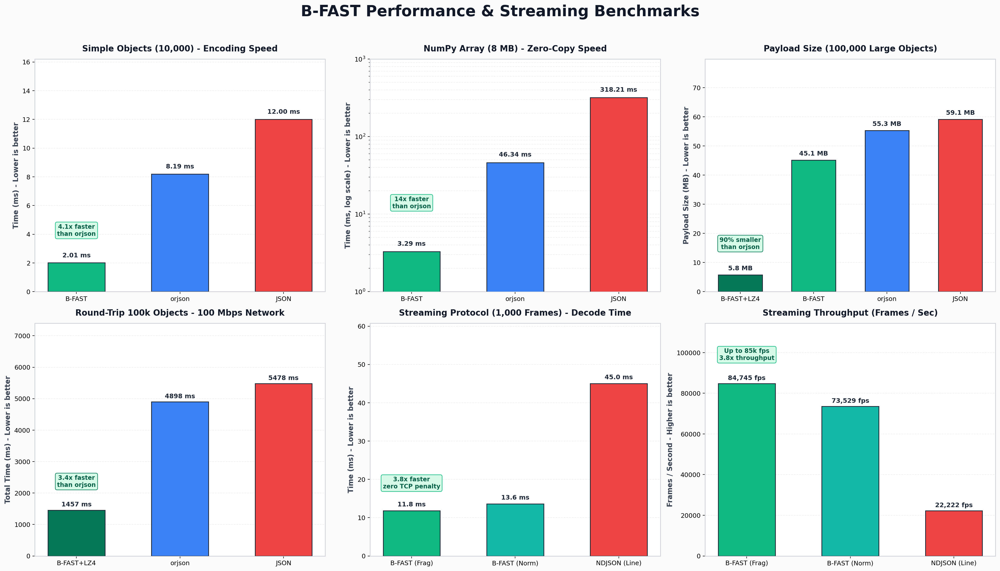

# ⚡ B-FAST (Binary Fast Adaptive Serialization Transfer)

<p align="center">
  <a href="https://github.com/marcelomarkus/b-fast/actions/workflows/tests.yml"></a>
  <a href="https://marcelomarkus.github.io/b-fast/"></a>
  <a href="https://pypi.org/project/bfast-py/"></a>
  <a href="https://pypi.org/project/bfast-py/"></a>
  <a href="https://www.npmjs.com/package/bfast-client"></a>
  <a href="https://opensource.org/licenses/MIT"></a>
  <a href="https://marcelomarkus.github.io/b-fast/performance/"></a>
  <a href="https://app.codspeed.io/marcelomarkus/b-fast?utm_source=badge"></a>
</p>

B-FAST is an ultra-high performance binary serialization protocol, developed in Rust for Python and TypeScript ecosystems. It's designed to replace JSON in critical routes where latency, CPU usage, and bandwidth are bottlenecks.

> "Performance is not just about speed—it's about efficiency where it matters most"

B-FAST was born from the recognition that modern applications need more than just fast serialization—they need **smart serialization** that adapts to real-world constraints. After extensive optimization, B-FAST has found its perfect niche in bandwidth-constrained environments, achieving **1.7x faster** than orjson for simple objects and **5.7x faster** on slow networks.

**Philosophy:** We believe that the future of data transfer lies not in raw CPU speed alone, but in intelligent protocols that minimize network overhead while maintaining excellent performance. B-FAST represents our contribution to a more efficient, bandwidth-conscious web.

## 📚 Documentation
Full documentation available at: **https://marcelomarkus.github.io/b-fast/**

## 🚀 Why B-FAST?
- **Rust Engine:** Native serialization without Python interpreter overhead.
- **Pydantic Native:** Reads Pydantic model attributes directly from memory, skipping the slow .model_dump() process.
- **Zero-Copy NumPy:** Serializes tensors and numeric arrays directly, achieving 14-96x speedup vs JSON/orjson.
- **Parallel Compression:** LZ4 with multi-thread processing for large payloads (>1MB).
- **Cache Optimized:** Aligned allocation and batch processing for maximum efficiency.

## 📊 Benchmarks (Updated Results)

### 🚀 Simple Objects (10,000)
| Format | Time (ms) | Speedup |
|--------|-----------|---------|
| JSON | 12.0ms | 1.0x |
| orjson | 8.19ms | 1.5x |
| **B-FAST** | **2.01ms** | **🚀 6.0x** |

**B-FAST is 4.1x faster than orjson!**

### 🌊 Streaming Protocol (1,000 frames)
| Metric | Performance | Speedup / Throughput |
|--------|-------------|----------------------|
| **Streaming Decode (Aligned)** | **11.8ms** | **~85,000 frames/s** |
| **Streaming Decode (Fragmented)** | **13.6ms** | **~73,500 frames/s** |
| **Single Frame Latency** | **139.2µs** | **Real-time instant parsing** |
| **Sustained Stream Throughput** | **12,500 frames/s** | **High-frequency event feeds** |

### 🔄 Round-Trip (Encode + Network + Decode)
Complete test including network transfer and deserialization (10,000 objects):

#### 📡 100 Mbps (Slow Network)
| Format | Total Time | Speedup vs orjson |
|--------|------------|-------------------|
| JSON | 114.5ms | 0.8x |
| orjson | 91.7ms | 1.0x |
| **B-FAST + LZ4** | **16.1ms** | **🚀 5.7x** |

#### 📡 1 Gbps (Fast Network)
| Format | Total Time | Speedup vs orjson |
|--------|------------|-------------------|
| JSON | 29.4ms | 0.5x |
| orjson | 15.3ms | 1.0x |
| **B-FAST + LZ4** | **7.2ms** | **🚀 2.1x** |

#### 📡 10 Gbps (Ultra-Fast Network)
| Format | Total Time | Speedup vs orjson |
|--------|------------|-------------------|
| JSON | 20.9ms | 0.4x |
| orjson | 7.7ms | 1.0x |
| **B-FAST + LZ4** | **6.3ms** | **🚀 1.2x** |

### 🎯 Ideal Use Cases
- **📱 Mobile/IoT**: 89% data savings + 5.7x performance on slow networks
- **🌐 APIs with slow networks**: Up to 5.7x faster than orjson
- **📊 Data pipelines**: 14-96x speedup for NumPy arrays
- **🗜️ Storage/Cache**: Superior integrated compression
- **🚀 Simple objects**: 4.1x faster than orjson
- **🌊 Real-time Streaming**: > 12,500 frames/s with zero-allocation chunk parsing

## 📦 Installation

### Backend (Python)
```bash
# Basic installation
pip install bfast-py

# With FastAPI support
pip install "bfast-py[fastapi]"
```
or with `uv`:
```bash
uv add bfast-py
# or
uv add "bfast-py[fastapi]"
```

### Frontend (TypeScript)
```bash
npm install bfast-client
```

## 🛠️ How to Use

### Backend (Python)

#### 1. FastAPI (Direct Integration) ⭐ Recommended
B-FAST includes a built-in `BFastResponse` for seamless integration.

```python
from fastapi import FastAPI
from pydantic import BaseModel
from b_fast import BFastResponse

app = FastAPI()

class User(BaseModel):
    id: int
    name: str

@app.get("/users", response_class=BFastResponse)
async def get_users():
    # Returns binary B-FAST data with automatic LZ4 compression
    return [User(id=i, name=f"User {i}") for i in range(1000)]

# ⚡ Streamable HTTP (Progressive Chunks)
from b_fast import BFastStreamingResponse

@app.get("/users/stream")
async def stream_users():
    async def user_generator():
        for i in range(1000):
            yield User(id=i, name=f"User {i}")
    
    # Streams framed chunks with Content-Type: application/x-bfast-stream
    return BFastStreamingResponse(user_generator())
```

#### 2. Flask
```python
from flask import Flask, Response
import b_fast

app = Flask(__name__)
encoder = b_fast.BFast()

@app.route('/users')
def get_users():
    users = [{"id": i, "name": f"User {i}"} for i in range(1000)]
    data = encoder.encode_packed(users, compress=True)
    return Response(data, mimetype='application/octet-stream')
```

#### 3. Django
```python
from django.http import HttpResponse
import b_fast

encoder = b_fast.BFast()

def get_users(request):
    users = [{"id": i, "name": f"User {i}"} for i in range(1000)]
    data = encoder.encode_packed(users, compress=True)
    return HttpResponse(data, content_type='application/octet-stream')
```

#### 4. Any Python Framework
```python
import b_fast

encoder = b_fast.BFast()

# Encode your data
data = encoder.encode_packed(your_data, compress=True)

# Return as bytes (binary response)
```

### Frontend (TypeScript)

#### 1. Standard Response
```typescript
import { BFastDecoder } from 'bfast-client';

async function loadData() {
    const response = await fetch('/users');
    const buffer = await response.arrayBuffer();
    
    // Decodes and decompresses LZ4 automatically
    const users = BFastDecoder.decode(buffer);
    console.log(users);
}
```

#### 2. Streamable HTTP (Progressive Stream)
```typescript
import { decodeReadableStream } from 'bfast-client';

async function streamData() {
    const response = await fetch('/users/stream');
    
    // Iterates over incoming network chunks in real-time
    for await (const user of decodeReadableStream(response.body!)) {
        console.log('Received user in real-time:', user);
    }
}
```

## About B-FAST

**Key Achievements:**
- 🚀 **4.1x faster** than orjson for simple objects (2.01 ms)
- 🚀 **5.7x faster** than orjson on 100 Mbps networks (round-trip)
- 🌊 **12,500+ frames/sec** sustained streaming throughput (~139 µs latency)
- 📦 **89% smaller** payloads with built-in LZ4 compression
- ⚡ **14-96x speedup** for NumPy arrays
- 🎯 **Competitive** even on ultra-fast 10 Gbps networks

<p align="center">
  
</p>

<p align="center">
  <em>B-FAST performance comparison across 6 key scenarios: simple objects encoding, zero-copy NumPy arrays, payload size, 100 Mbps round-trip, streaming decode time, and streaming throughput. B-FAST demonstrates clear superiority in speed (2.1-14x faster) and bandwidth efficiency (90% reduction with LZ4).</em>
</p>

**Developed by:** [marcelomarkus](https://github.com/marcelomarkus)

## 📄 License
Distributed under the MIT License. See LICENSE for more information.