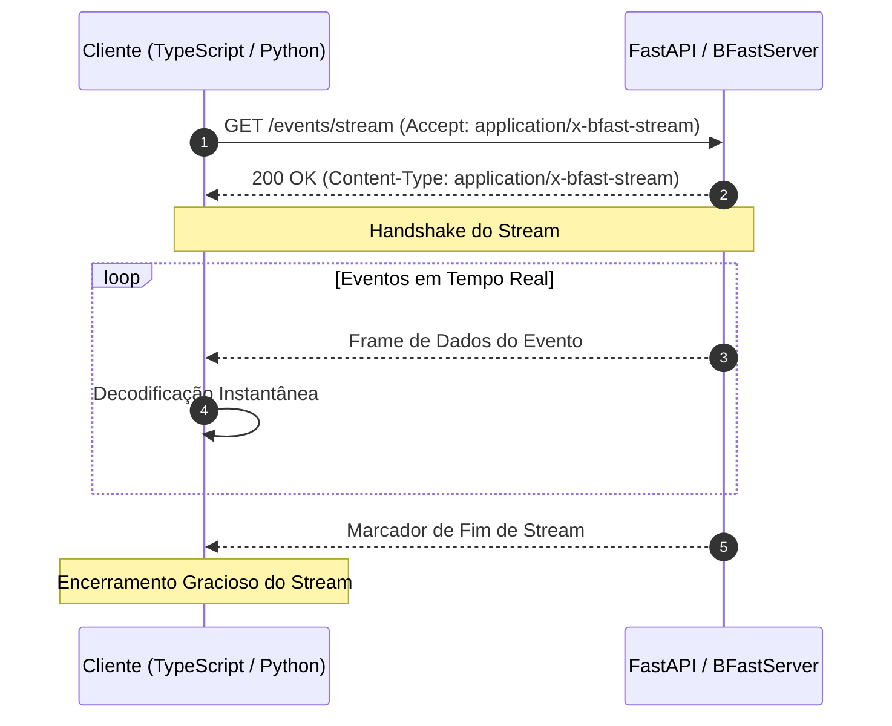

# 🌊 Protocolo de Streaming HTTP & Integração MCP

O B-FAST inclui um protocolo nativo de streaming binário projetado para feeds de dados contínuos e de baixa latência sobre HTTP/1.1 (Chunked Transfer) e HTTP/2 / HTTP/3 (Streaming DATA Frames).

Ele serve como base para dashboards em tempo real, pipelines de telemetria IoT e streaming de ferramentas do **Model Context Protocol (MCP)** para agentes de IA.

---

## 🚀 Principais Vantagens

<div class="grid cards" markdown>

-   __⚡ Ultra-Baixa Latência__

    ---

    Latência de apenas **139.2 µs** por frame único e **11.8 ms** para decodificar 1.000 frames (~85.000 frames/s).

-   __🧠 Processamento de Chunks em O(1)__

    ---

    Máquina de estados *zero-copy* que gerencia a fragmentação de pacotes de rede sem realocações excessivas de memória.

-   __🤖 Suporte Nativo ao MCP__

    ---

    Integração direta com o transporte Streamable HTTP do Model Context Protocol da Anthropic.

-   __🛡️ Proteção Integrada Contra DoS__

    ---

    Parâmetro configurável `max_frame_size` que protege serviços contra payloads gigantes ou corrompidos.

</div>

---

## 📡 Arquitetura de Streaming

O B-FAST adota uma arquitetura de streaming de alta eficiência (`application/x-bfast-stream`) projetada para transmissão contínua de chunks sobre HTTP padrão:

- **Entrega Incremental**: Cada item é serializado e transmitido imediatamente assim que gerado, sem acúmulo desnecessário de memória no servidor.
- **Framing Automático**: O protocolo gerencia fronteiras de pacotes e remonta fragmentos de rede de forma transparente para o cliente.
- **Finalização Graciosa**: O fluxo sinaliza o encerramento natural ao final da iteração, permitindo aos clientes fechar conexões de forma limpa.

### Ciclo de Vida do Stream



---

## 🐍 Backend: Integração com FastAPI

O B-FAST disponibiliza `BFastStreamingResponse`, uma resposta de streaming pronta para uso que serializa dados sob demanda.

### Exemplo com Gerador Assíncrono

```python
import asyncio
from typing import AsyncGenerator
from fastapi import FastAPI
from b_fast import BFastStreamingResponse

app = FastAPI(title="B-FAST Streaming API")

async def event_generator() -> AsyncGenerator[dict, None]:
    for i in range(100):
        await asyncio.sleep(0.01)  # Simula dados em tempo real
        yield {
            "event_id": i,
            "metric": "cpu_usage",
            "value": 42.5 + i * 0.1,
            "status": "ok"
        }

@app.get("/events/stream")
async def stream_metrics():
    return BFastStreamingResponse(
        event_generator(),
        compress=False  # Ultra-baixa latência sem overhead de compressão
    )
```

!!! tip "Quando usar compressão no streaming"
    Para eventos pequenos de altíssima frequência (< 1KB), mantenha `compress=False` para evitar custo de CPU. Para frames de telemetria maiores (> 10KB), passe `compress=True` para economizar até 89% de banda de rede.

---

## 🤖 Integração com Model Context Protocol (MCP)

O B-FAST integra-se com o **Model Context Protocol (MCP)**, permitindo que agentes de IA façam streaming de saídas de ferramentas estruturadas com mínima latência.

```python
from b_fast.mcp import (
    is_bfast_stream_requested,
    stream_mcp_async_tool_results,
    wrap_mcp_tool_output,
)
from fastapi import FastAPI, Request

app = FastAPI()

@app.post("/mcp/tools/execute")
async def execute_tool(request: Request):
    # Verifica se o cliente negociou streaming binário B-FAST
    if is_bfast_stream_requested(request):
        async def tool_stream():
            for step in range(10):
                yield {"step": step, "progress": f"{step * 10}%", "data": [1.0, 2.0]}
        
        return stream_mcp_async_tool_results(tool_stream(), request=request)
    
    # Fallback para saída JSON padrão
    return {"status": "standard json output"}
```

---

## 💻 Frontend: Cliente TypeScript / JavaScript

O pacote `bfast-client` oferece `BFastStreamDecoder` e `decodeReadableStream` para decodificar streams fragmentados no navegador e no Node.js.

### Navegador (Fetch API com `ReadableStream`)

=== "Gerador Assíncrono (`decodeReadableStream`)"

    ```typescript
    import { decodeReadableStream } from "bfast-client";

    async function streamEvents() {
        const response = await fetch("/events/stream", {
            headers: { "Accept": "application/x-bfast-stream" }
        });

        if (!response.body) return;

        // Processa automaticamente chunks fragmentados em objetos decodificados
        for await (const event of decodeReadableStream(response.body)) {
            console.log("Evento recebido:", event);
        }
        
        console.log("Stream finalizado com sucesso!");
    }
    ```

=== "Alimentação Manual (`BFastStreamDecoder`)"

    ```typescript
    import { BFastStreamDecoder } from "bfast-client";

    const decoder = new BFastStreamDecoder();

    // Em um manipulador onmessage de WebSocket ou transporte personalizado:
    socket.onmessage = (event) => {
        const chunk = new Uint8Array(event.data);
        const items = decoder.feed(chunk);
        
        for (const item of items) {
            handleEvent(item);
        }

        if (decoder.isEos()) {
            console.log("Stream atingiu End-of-Stream");
        }
    };
    ```

### Node.js (Stream Pipeline)

```typescript
import { decodeNodeStream } from "bfast-client";
import http from "node:http";

http.get("http://localhost:8000/events/stream", async (res) => {
    for await (const record of decodeNodeStream(res)) {
        console.log("Registro:", record);
    }
});
```

---

## 📊 Benchmarks de Streaming

Medição em hardware padrão sobre 1.000 frames estruturados:

| Cenário | Tempo (ms) | Throughput | Latência por Frame |
| :--- | :---: | :---: | :---: |
| **Chunks Alinhados (1KB)** | **11.8 ms** | **~85.000 frames/s** | **139.2 µs** |
| **Chunks Fragmentados (MTU Aleatório)** | **13.6 ms** | **~73.500 frames/s** | **152.0 µs** |
| **Vazão Contínua Sustentada** | — | **> 12.500 frames/s** | **Tempo Real** |

!!! note "Tratamento de Pacotes Fragmentados"
    O `BFastStreamDecoder` mantém um buffer circular interno que retoma a decodificação de frames parciais através das fronteiras de pacotes TCP sem cópias redundantes de memória.
