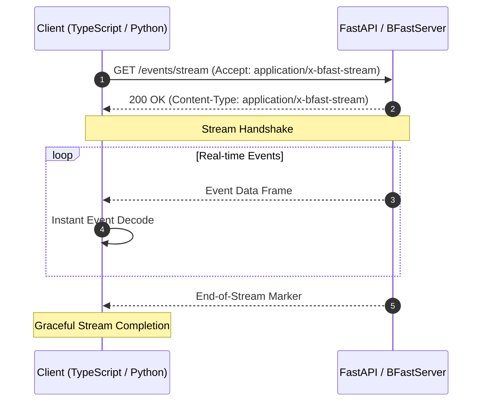

# 🌊 Streamable HTTP Protocol & MCP Integration

B-FAST includes a native binary streaming protocol designed for continuous, low-latency data feeds over HTTP/1.1 (Chunked Transfer) and HTTP/2 / HTTP/3 (Streaming DATA Frames).

It serves as the foundation for real-time dashboards, IoT event pipelines, and **Model Context Protocol (MCP)** tool streaming for AI agents.

---

## 🚀 Key Advantages

<div class="grid cards" markdown>

-   __⚡ Ultra-Low Latency__

    ---

    **139.2 µs** single-frame latency and **11.8 ms** decode time for 1,000 frames (~85,000 frames/s).

-   __🧠 O(1) Chunk Processing__

    ---

    Zero-copy state machine handles network packet fragmentation without full buffer reallocations.

-   __🤖 Native MCP Support__

    ---

    Seamless integration with Anthropic's Model Context Protocol (MCP) Streamable HTTP transport.

-   __🛡️ Built-in DoS Protection__

    ---

    Configurable `max_frame_size` protects services against oversized or malformed frame floods.

</div>

---

## 📡 Streaming Architecture

B-FAST uses an optimized streaming architecture (`application/x-bfast-stream`) designed for continuous, length-prefixed chunks over standard HTTP:

- **Incremental Delivery**: Items are transmitted as soon as they are yielded by the generator, avoiding any memory buffering on the server.
- **Automatic Framing**: The protocol handles chunk boundary detection and partial network packet reassembly automatically.
- **Graceful Termination**: The stream signals its completion cleanly, allowing the client to complete without abrupt disconnects.

### Stream Lifecycle



---

## 🐍 Backend: FastAPI Integration

B-FAST provides `BFastStreamingResponse`, a drop-in streaming response that serializes data on the fly.

### Asynchronous Generator Example

```python
import asyncio
from typing import AsyncGenerator
from fastapi import FastAPI
from b_fast import BFastStreamingResponse

app = FastAPI(title="B-FAST Streaming API")

async def event_generator() -> AsyncGenerator[dict, None]:
    for i in range(100):
        await asyncio.sleep(0.01)  # Simulate real-time data
        yield {
            "event_id": i,
            "metric": "cpu_usage",
            "value": 42.5 + i * 0.1,
            "status": "ok"
        }

@app.get("/events/stream")
async def stream_metrics():
    return BFastStreamingResponse(
        event_generator(),
        compress=False  # Ultra-low latency without compression overhead
    )
```

!!! tip "When to use compression in streaming"
    For high-frequency small events (< 1KB), keep `compress=False` to avoid compression CPU overhead. For larger telemetry frames (> 10KB), pass `compress=True` to save up to 89% bandwidth.

---

## 🤖 Model Context Protocol (MCP) Integration

B-FAST seamlessly integrates with the **Model Context Protocol (MCP)**, allowing AI agents to stream structured tool outputs with minimal latency.

```python
from b_fast.mcp import (
    is_bfast_stream_requested,
    stream_mcp_async_tool_results,
    wrap_mcp_tool_output,
)
from fastapi import FastAPI, Request

app = FastAPI()

@app.post("/mcp/tools/execute")
async def execute_tool(request: Request):
    # Check if client negotiated B-FAST binary streaming
    if is_bfast_stream_requested(request):
        async def tool_stream():
            for step in range(10):
                yield {"step": step, "progress": f"{step * 10}%", "data": [1.0, 2.0]}
        
        return stream_mcp_async_tool_results(tool_stream(), request=request)
    
    # Fallback to standard JSON output
    return {"status": "standard json output"}
```

---

## 💻 Frontend: TypeScript / JavaScript Client

The `bfast-client` library provides `BFastStreamDecoder` and `decodeReadableStream` for parsing chunked streams in browsers and Node.js.

### Browser (Fetch API with `ReadableStream`)

=== "Async Generator (`decodeReadableStream`)"

    ```typescript
    import { decodeReadableStream } from "bfast-client";

    async function streamEvents() {
        const response = await fetch("/events/stream", {
            headers: { "Accept": "application/x-bfast-stream" }
        });

        if (!response.body) return;

        // Automatically parses fragmented chunks into decoded objects
        for await (const event of decodeReadableStream(response.body)) {
            console.log("Received event:", event);
        }
        
        console.log("Stream completed gracefully!");
    }
    ```

=== "Manual Feeder (`BFastStreamDecoder`)"

    ```typescript
    import { BFastStreamDecoder } from "bfast-client";

    const decoder = new BFastStreamDecoder();

    // In a WebSocket or custom transport onmessage handler:
    socket.onmessage = (event) => {
        const chunk = new Uint8Array(event.data);
        const items = decoder.feed(chunk);
        
        for (const item of items) {
            handleEvent(item);
        }

        if (decoder.isEos()) {
            console.log("Stream reached End-of-Stream");
        }
    };
    ```

### Node.js (Stream Pipeline)

```typescript
import { decodeNodeStream } from "bfast-client";
import http from "node:http";

http.get("http://localhost:8000/events/stream", async (res) => {
    for await (const record of decodeNodeStream(res)) {
        console.log("Record:", record);
    }
});
```

---

## 📊 Streaming Benchmarks

Measured on standard commodity hardware across 1,000 structured frames:

| Scenario | Time (ms) | Throughput | Frame Latency |
| :--- | :---: | :---: | :---: |
| **Aligned Chunks (1KB)** | **11.8 ms** | **~85,000 frames/s** | **139.2 µs** |
| **Fragmented Chunks (Random MTU)** | **13.6 ms** | **~73,500 frames/s** | **152.0 µs** |
| **Sustained Stream Throughput** | — | **> 12,500 frames/s** | **Real-Time** |

!!! note "Fragmented Packets Handling"
    `BFastStreamDecoder` automatically reassembles partial frames across network chunk boundaries without requiring manual packet tracking.
